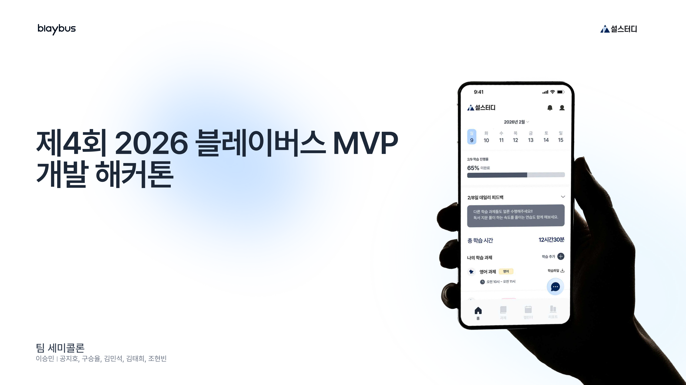
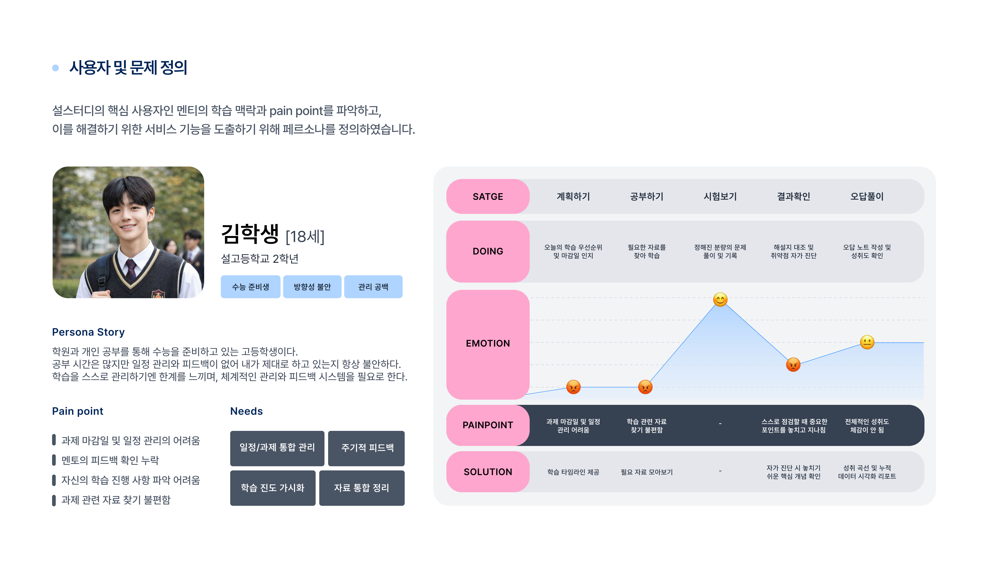
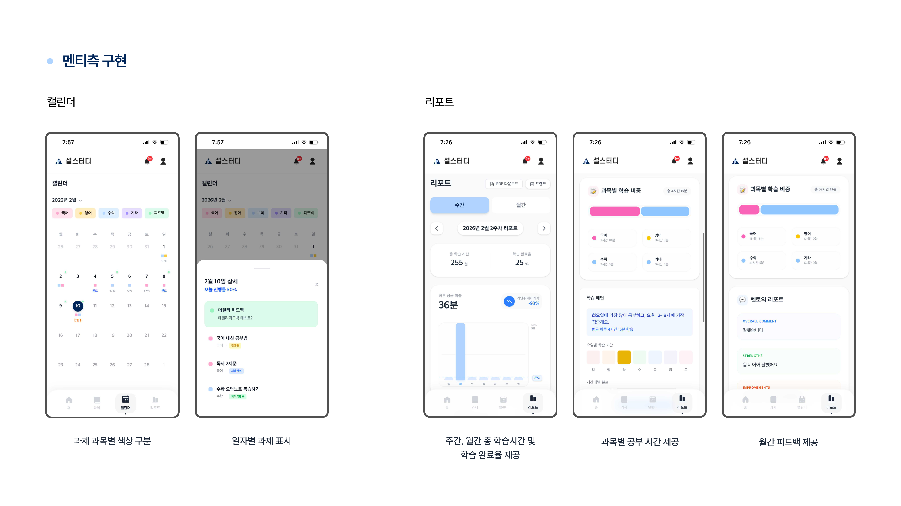
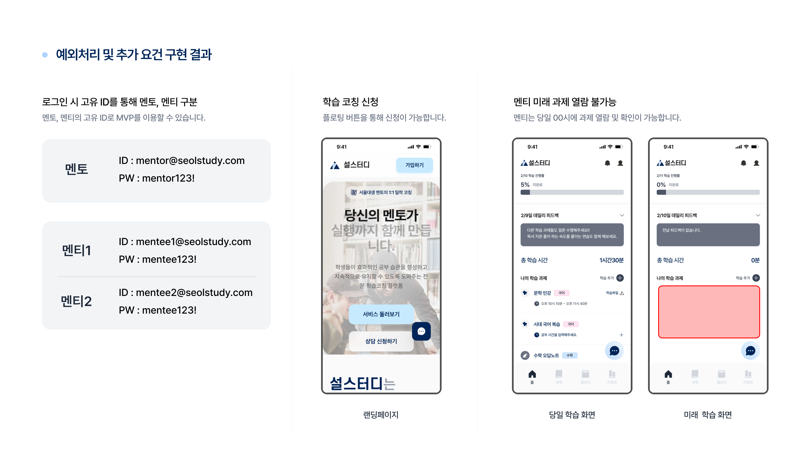

# 설스터디 — 블레이버스 제4회 MVP 개발 해커톤

수능 국어·영어·수학을 준비하는 멘티와 멘토를 연결하는 학습 코칭 플랫폼입니다. 멘토가 플랜을 짜주면 멘티는 모바일로 공부 기록을 남기고, 멘토는 그 데이터를 보고 피드백을 줍니다. 6인 팀("세미콜론": 이승민·공지호·구승율·**김민석**·김태희·조현빈)으로 참가했고, 저는 프론트엔드(Next.js App Router, TailwindCSS, Zustand)를 맡았습니다.

## 서비스 구조

- **멘티 (모바일 최적화)**: 일일/주간/월간 플래너, 공부 시간 기록, 과제 제출
  (이미지 업로드), 과목별 피드백 확인, 학습 리포트(과목별 학습 비중·패턴)
- **멘토 (PC 최적화)**: 멘티 목록/현황 관리, 과제 등록, 학습지(칼럼/PDF)
  업로드, 과목별 상세 피드백 작성

## 기술 스택

| 영역 | 스택 |
|---|---|
| Frontend | Next.js 14 (App Router), TypeScript, TailwindCSS + shadcn/ui, Zustand |
| Backend | Node.js + Express.js, TypeScript, Prisma ORM, PostgreSQL |
| Infra | Vercel(Frontend) · Railway(Backend) · Neon(PostgreSQL) · Cloudinary(이미지/PDF) |

## 화면

**랜딩 페이지 & 대시보드**



**페르소나 — 사용자 및 문제 정의**



수능 준비생 페르소나를 계획 → 공부 → 시험 → 결과확인 → 오답풀이 단계로 나눠보고, 각 단계에서 뭐가 불편한지부터 짚어서 기능을 뽑았습니다.

**멘티 화면 — 캘린더 & 리포트**



과목마다 색을 다르게 준 캘린더, 주간/월간 학습시간과 완료율, 과목별 비중과 멘토 피드백을 한눈에 보는 리포트 화면입니다.

**예외처리 & 테스트 계정**



로그인 ID로 멘토/멘티를 구분했고, 멘티가 아직 오지 않은 날짜의 과제를 미리 열람할 수 없게 막아뒀습니다.

전체 슬라이드(23장)는 [`images/`](images)에 `page-01.png` ~ `page-23.png`
순서로 들어 있습니다.

## API 개요 (팀 저장소 기준)

```
POST   /api/auth/login                  로그인
GET    /api/auth/me                     현재 사용자

GET    /api/mentee/planner/daily        일일 플래너
GET    /api/mentee/planner/weekly       주간 플래너
GET    /api/mentee/planner/monthly      월간 플래너
POST   /api/mentee/tasks                할 일 추가
PATCH  /api/mentee/tasks/:id/complete   완료 처리
POST   /api/mentee/tasks/:id/submit     과제 제출
GET    /api/mentee/feedbacks            피드백 목록

GET    /api/mentor/mentees              멘티 목록
POST   /api/mentor/tasks                할 일 생성
POST   /api/mentor/feedbacks            피드백 작성
POST   /api/mentor/worksheets           학습지 생성

POST   /api/upload/image                이미지 업로드
POST   /api/upload/pdf                  PDF 업로드
```

## 소스 코드

6인 팀 프로젝트라 코드를 여기 다시 올리진 않았고, 이미 공개돼 있는 팀 저장소로 링크만 걸어둡니다.

- **저장소**: https://github.com/RublerubitZ/semicolon
- **배포 링크**: https://semicolon-phi.vercel.app
- **팀 구성**: PM 이승민 · 프론트엔드 김민석 · 백엔드 구승율/조현빈 · UI/UX 공지호/김태희

원본 발표자료: [`블레이버스 제4회 MVP 개발 해커톤 발표자료_세미콜론_최종본.pdf`](%EB%B8%94%EB%A0%88%EC%9D%B4%EB%B2%84%EC%8A%A4%20%EC%A0%9C4%ED%9A%8C%20MVP%20%EA%AC%AC%EB%B0%9C%20%ED%95%B4%EC%BB%A4%ED%86%A4%20%EB%B0%9C%ED%91%9C%EC%9E%90%EB%A3%8C_%EC%84%B8%EB%AF%B8%EC%BD%9C%EB%A1%A0_%EC%B5%9C%EC%A2%85%EB%B3%B8.pdf)
